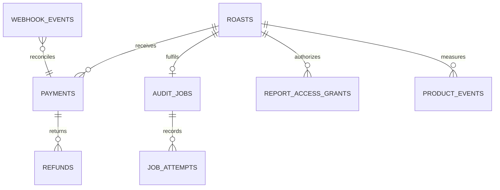

# Durable data model

- Status: Implemented for POR-6
- Source of truth: `src/db/schema.ts`
- Migrations: `drizzle/`
- Production database: Neon PostgreSQL through Drizzle ORM
- Clean-database test: PGlite running the committed PostgreSQL migrations

## Ownership

`webhook_events` intentionally has no foreign key to `payments`: a valid provider event may arrive before its referenced order/payment has been reconciled locally. The processor uses provider identifiers to reconcile it later without discarding or forging ordering.

## Invariants

- A Roast tracks fulfilment; it never substitutes for Payment or Refund state.
- Phase 1 payments are exactly 19,900 paise in INR. Browser-supplied price is never authoritative.
- One Roast can create at most one logical Audit Job. Each execution is a separately numbered Job Attempt.
- Provider event IDs, Razorpay order/payment IDs, receipts, QStash message IDs, and refund idempotency keys are unique at the appropriate boundary.
- State changes are checked twice: typed transition graphs reject invalid application calls and PostgreSQL triggers reject direct or accidental regressions.
- A Report Access Grant stores a 64-character SHA-256 hash of a 256-bit random token. Only one grant may be active for a Roast; revocation permits rotation without deleting audit evidence.
- Product Events use a fixed enum and fixed columns. They have no arbitrary properties, email, URL, payment ID, or report token field.
- No table contains screenshot bytes or a screenshot URL.

## Privacy boundary

The normalized email is stored on the private Roast record for transactional delivery. The customer report lookup selects only Roast ID, canonical URL, hostname, and grant creation time; its return type has no email field. Application logs must never serialize full Roast records.

Webhook `verified_payload` is a private processing record, not an analytics or logging payload. POR-27 owns its retention and deletion schedule.

## Migration workflow

1. Change `src/db/schema.ts`.
2. Run `pnpm db:generate` and review every generated SQL statement.
3. Put non-schema PostgreSQL behavior in a named custom forward migration.
4. Run `pnpm db:check` and the clean-database test suite.
5. Never edit a migration after it has reached a shared environment; add a corrective forward migration.

`drizzle-kit push` is not part of the production workflow because it bypasses the reviewed migration history.
